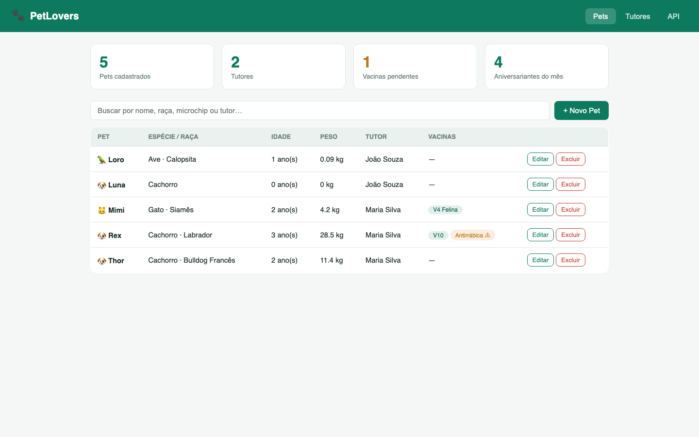
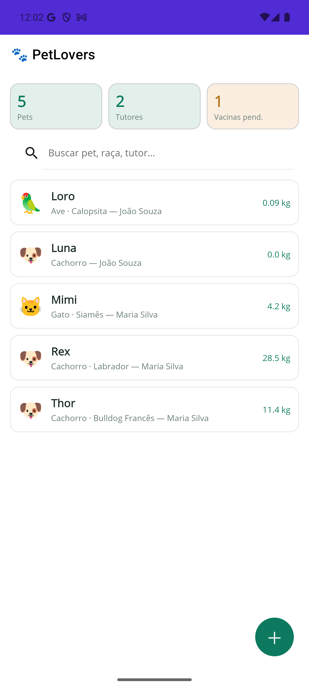
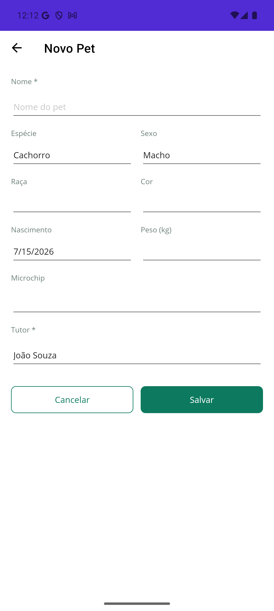
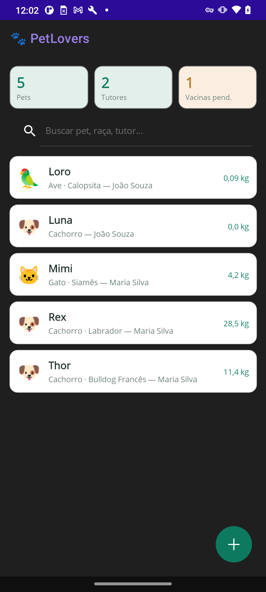
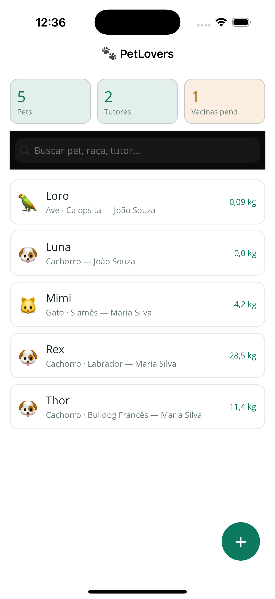

# PetLovers 🐾

Sistema de cadastro e gestão de pets em uma única solution .NET, com API REST, portal web HTML e app mobile .NET MAUI (Android e iOS).

> Projeto de demonstração: uma única base C# servindo web, mobile e API, com dados de exemplo fictícios criados automaticamente na primeira execução.

## Screenshots

### Portal Web (HTML + API REST)


### App Mobile (.NET MAUI — Android e iOS)
| Android (emulador) | Cadastro | Tema escuro (dispositivo físico) | iOS (simulador) |
|---|---|---|---|
|  |  |  |  |

*Imagens reais da aplicação rodando: portal em `localhost:5155`, app em emulador Pixel 8 Pro (API 35), em um Moto G(9) Play físico e no simulador de iPhone 16 Pro — todos consumindo a mesma API, com a mesma base de código C#.*

## Estrutura

```
PetLovers.slnx
├── src/
│   ├── PetLovers.Domain           # Entidades e regras de negócio (C#)
│   ├── PetLovers.Infrastructure   # EF Core — SQL Server / SQLite
│   ├── PetLovers.API              # ASP.NET Core Web API (REST + Swagger)
│   ├── PetLovers.Web              # Site HTML (portal do tutor)
│   └── PetLovers.Mobile           # .NET MAUI — Android e iOS
└── tests/
    └── PetLovers.UnitTests        # Testes xUnit
```

## Pré-requisitos

| Para rodar | Precisa de |
|---|---|
| API + site web | [.NET 10 SDK](https://dotnet.microsoft.com/download) + Docker (SQL Server) — ou só o SDK, usando SQLite |
| App Android | Workload MAUI (`dotnet workload install maui`) + Android SDK (instalado junto com o Android Studio) |
| App iOS | Mac com Xcode |
| SQL Server | Opcional — por padrão usa SQLite local, zero configuração |

## Como rodar

### 1. Clonar e rodar a API + Site Web (funciona em qualquer máquina com .NET 10)
```bash
git clone https://github.com/tiagobpompeo/PetLovers.git
cd PetLovers
dotnet run --project src/PetLovers.API --launch-profile http
```
- Portal web: http://localhost:5155
- Swagger: http://localhost:5155/swagger

O schema e os dados de exemplo são criados automaticamente na inicialização — **não há passo manual de banco de dados**.

### Banco de dados

O projeto suporta dois provedores, alternados por `Database:UseSqlServer` em
`src/PetLovers.API/appsettings.json`.

**SQL Server (padrão)** — sobe em container e o schema é aplicado por *migrations*:

```bash
docker run -d --name petlovers-sql --platform linux/amd64 \
  -e "ACCEPT_EULA=Y" -e "MSSQL_SA_PASSWORD=SUA_SENHA_FORTE" \
  -p 1433:1433 mcr.microsoft.com/mssql/server:2022-latest

dotnet user-secrets set "ConnectionStrings:SqlServer" \
  "Server=localhost,1433;Database=PetLovers;User Id=sa;Password=SUA_SENHA_FORTE;TrustServerCertificate=True" \
  --project src/PetLovers.API
```

> A connection string fica em **user-secrets** (fora do repositório) — nunca commite senhas.
> No Apple Silicon, `--platform linux/amd64` é necessário: o SQL Server não tem imagem ARM nativa.

**SQLite (demo rápida, sem Docker)** — defina `"UseSqlServer": false`; o arquivo
`petlovers.db` é criado via `EnsureCreated()` na primeira execução.

### Migrations

As migrations são **específicas do provedor** (o SQL Server usa `nvarchar`/`Identity`;
o SQLite usa `TEXT`/`Autoincrement`). As atuais são de SQL Server:

```bash
dotnet ef migrations add <Nome> --project src/PetLovers.Infrastructure --startup-project src/PetLovers.API
```

### 2. App Mobile (.NET MAUI)

Com a API rodando (passo 1) e um emulador aberto ou dispositivo conectado (`adb devices` para conferir):

```bash
# Android — emulador (o app usa http://10.0.2.2:5155 automaticamente)
dotnet build src/PetLovers.Mobile -f net10.0-android -t:Run -p:AdbTarget="-s emulator-5554"

# Android — dispositivo físico via USB (o app usa http://localhost:5155 pelo túnel adb)
adb -s <SERIAL> reverse tcp:5155 tcp:5155   # refazer a cada reconexão do USB
dotnet build src/PetLovers.Mobile -f net10.0-android -t:Run -p:AdbTarget="-s <SERIAL>"

# iOS (requer Mac + Xcode) — compile primeiro, depois lance no simulador
dotnet build src/PetLovers.Mobile -f net10.0-ios
dotnet build src/PetLovers.Mobile -f net10.0-ios -t:Run
```

> **Dica (iOS):** se o seu Xcode for mais novo que o exigido pelo workload MAUI
> (erro "requires Xcode X.Y"), rode `dotnet workload update` para alinhar as versões
> ou adicione `-p:ValidateXcodeVersion=false` aos comandos acima (seguro para
> diferenças de versão minor). Para escolher o simulador:
> `-p:_DeviceName=:v2:udid=<UDID>` (liste os UDIDs com `xcrun simctl list devices`).
A detecção é automática (`DeviceInfo.DeviceType == Virtual` → emulador). Use `adb devices` para obter o serial. Com múltiplos dispositivos conectados, `-p:AdbTarget` escolhe o alvo.

### 3. Testes
```bash
dotnet test tests/PetLovers.UnitTests
```

### Rodando no Rider / Visual Studio

Abra `PetLovers.slnx`, selecione o perfil **`PetLovers.API: http`** e execute. Para o mobile, selecione `PetLovers.Mobile` e escolha o dispositivo no seletor. O arquivo `src/PetLovers.API/PetLovers.http` tem todas as requisições da API prontas para testar no HTTP Client do IDE.

## API REST — principais endpoints

| Método | Rota | Descrição |
|---|---|---|
| GET | `/api/pets?busca=` | Lista pets (filtro por nome, raça, microchip, tutor) |
| GET | `/api/pets/{id}` | Detalhe do pet com vacinas |
| POST | `/api/pets` | Cadastra pet |
| PUT | `/api/pets/{id}` | Atualiza pet |
| DELETE | `/api/pets/{id}` | Remove pet |
| POST | `/api/pets/{id}/vacinas` | Registra vacina |
| GET/POST/PUT/DELETE | `/api/tutores` | CRUD de tutores |
| GET | `/api/dashboard` | Indicadores (pets, tutores, vacinas pendentes, aniversariantes) |

## Azure DevOps

O pipeline CI está em `azure-pipelines.yml` (build + testes + artefatos).
Para publicar no Azure DevOps Repos:

```bash
git init
git add .
git commit -m "MVP PetLovers"
git remote add origin https://dev.azure.com/SUA_ORG/SEU_PROJETO/_git/PetLovers
git push -u origin main
```

## Próximos passos (fora do MVP)

- Autenticação JWT / Identity
- Upload de fotos dos pets
- Agendamentos (consultas, banho/tosa) com lembretes
- Migrations do EF Core (hoje usa `EnsureCreated`)
- FluentValidation e Serilog
- Pipeline de publicação (CD) para Azure App Service e lojas mobile
